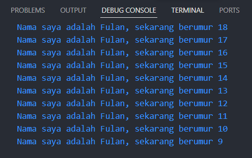

## TUGAS PRAKTIKUM

1. Modifikasilah kode pada baris 3 di VS Code atau Editor Code favorit Anda berikut ini agar mendapatkan keluaran (output) sesuai yang diminta!
``` dart
void main() {
  for (int i = 0; i > 10; i++) {
    print('hello ${i + 2}');
  }
}
```

Jawaban:
``` dart
void main() {
  String name = "Fulan";
  int age = 18;
  for (int i = age; i > 0; i--) {
    if (i == 8) {
      break;
    }
    print('Nama saya adalah $name, sekarang berumur $i');
  }
}
```

Output:



2. Mengapa sangat penting untuk memahami bahasa pemrograman Dart sebelum kita menggunakan framework Flutter ? Jelaskan!

Jawaban:

Dasar dari flutter yaitu dart. Semua kode yang ditulis dalam Flutter sebenarnya adalah kode Dart. Dengan memahami Dart, Akan lebih mudah memahami bagaimana Flutter bekerja dan bagaimana menulis kode yang efisien

3. Rangkumlah materi dari codelab ini menjadi poin-poin penting yang dapat Anda gunakan untuk membantu proses pengembangan aplikasi mobile menggunakan framework Flutter.

[Rangkuman Jawaban Nomor 3](https://drive.google.com/drive/folders/1uHv2iMoWiJyFmyr9_JntBa2gwJxTgAJu?usp=drive_link)