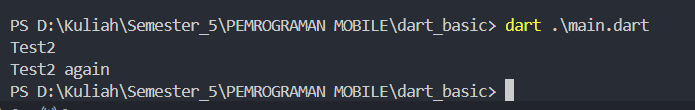
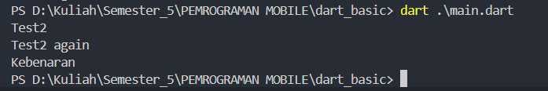
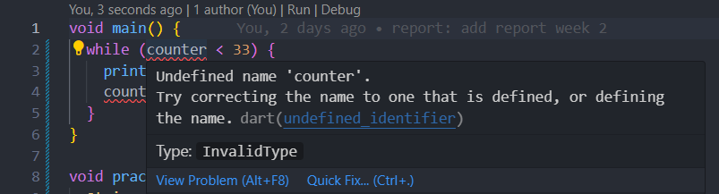
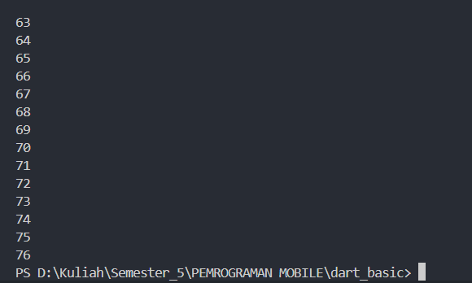
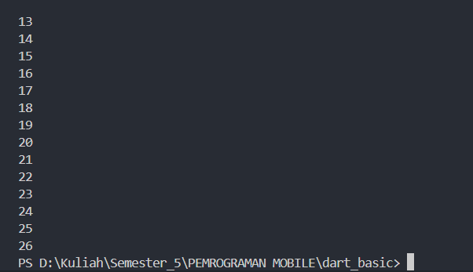
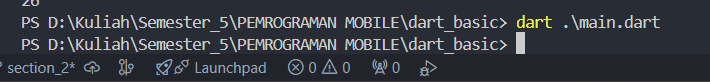
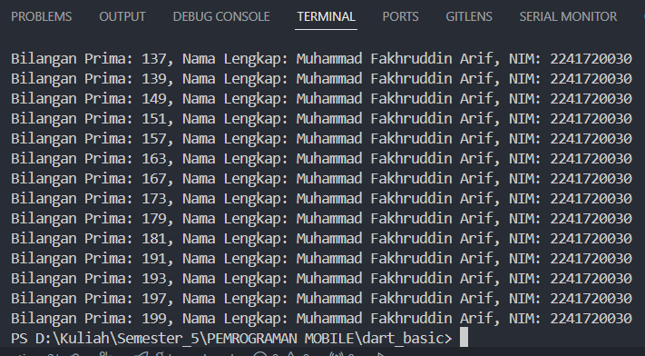

## TUGAS PRAKTIKUM

``` text
Nama  : Muhammad Fakhruddin Arif
Kelas : 3C
Nomor : 16
```

1. Silakan selesaikan Praktikum 1 sampai 3, lalu dokumentasikan berupa screenshot hasil pekerjaan beserta penjelasannya!

Jawaban:
- Praktikum 1
1. Hasil Output:

2. Penjelasan Langkah 1:
``` text
- Variabel test bertipe String diinisialisasi dengan nilai "test2".
- Kemudian terjadi pengecekan variabel test terhadap "test1", ternyata tidak ada kesamaan value. Kemudian turun pada pengecekan kedua yaitu "test2", ternyata pada pengecekan kedua sesuai maka akan menampilkan output "test2" dan mengabaikan perulangan yang dibawahnya.
- Kemudian yang terakhir terdapat pengecekan lagi dengan "test2" dan sesuai lagi, maka ditampilkan output "test2 again"
```
3. Terjadi error pengulangan inisialisasi variabel test dengan pada perulangan tidak ada perbandingan value. Dan berikut hasil modifikasi source code:
``` dart
  String test = "test2";
  if (test == "test1") {
     print("Test1");
  }   else if (test == "test2") {
     print("Test2");
  } else {
     print("Something else");
  }

  if (test == "test2") print("Test2 again");

  test = "true";
  if (test == "true") {
   print("Kebenaran");
  }
```
Dengan hasil output sebagai berikut:


- Praktikum 2
1. Langkah 2: Terjadi error seperti pada gambar dibawah ini

Dikarenakan varibel counter belum diinisialisasi. Dan berikut ini source code yang telah dibenarkan
``` dart
   int counter = 0;
  while (counter < 33) {
    print(counter);
    counter++;
  }
```
2. Langkah 3: Tidak terjadi error dikarenakan telah diinisialisasi untuk variabel counter. Berikut output dari source code tersebut


- Praktikum 3
1. Langkah 2: Terjadi error dikarenakan pada variabel tidak dituliskan tipe data, perbandingan variabel didalam looping tidak sesuai dengan inisialisasi, dan pada perulangan akhir tidak adanya ++ untuk mengakhiri perulangan. Dan berikut ini source yang telah diperbaiki
``` dart
   for (int Index = 10; Index < 27; Index++) {
    print(Index);
  }
```
Berikut output tersebut:

2. Langkah 3: Terjadi error dikarenakan banyaknya kesalahan penulisan syntax dimulai dari if yang menggunakan huruf besar diawal, else if yang setiap kata diawali huruf besar, dan variabel index yang harus menggunakan huruf besar diawal kata. Berikut ini adalah hasil perbaikan source code:
``` dart
   for (int Index = 10; Index < 27; Index++) {
      if (Index == 21) break;
      else if (Index > 1 || Index < 7) continue;
      print(Index);
  }
```

Hasil dari source code ini tidak menghasilkan nilai apapun dikarenakan terdapat kondisi jika index lebih besar dari 1 atau lebih kecil dari 7 maka continue atau lanjut perulangan dan jika index samadengan 21 maka perulangan diakhiri. Dengan output seperti berikut


2. Buatlah sebuah program yang dapat menampilkan bilangan prima dari angka 0 sampai 201 menggunakan Dart. Ketika bilangan prima ditemukan, maka tampilkan nama lengkap dan NIM Anda.

Jawaban:
``` dart
void main() {
  const String id = "2241720030";
  const String name = "Muhammad Fakhruddin Arif";
  for (int i = 0; i < 201; i++) {
    if (isPrime(i)) {
      print("Bilangan Prima: $i, Nama Lengkap: $name, NIM: $id");
    }
  }
}

bool isPrime(int num) {
  if (num <= 1) return false;
  if (num == 2 || num == 3) return true;
  if (num % 2 == 0 || num % 3 == 0) return false;

  for (int i = 5; i * i <= num; i += 6) {
    if (num % i == 0 || num % (i + 2) == 0) return false;
  }
  return true;
}
```
Berikut output dari source code diatas:
