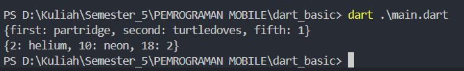

## TUGAS PRAKTIKUM

``` text
Nama  : Muhammad Fakhruddin Arif
Kelas : 3C
Nomor : 16
```

### PRAKTIKUM 1
- Langkah 1 dan Langkah 2
``` text
1. Membuat inisialisasi variabel list
2. Assert memeriksa panjang list sama dengan 3 atau tidak, jika tidak maka terdapat error (Hanya berlaku pada mode debug)
3. Assert memeriksa nilai elemen kedua sama dengan 2 atau tidak, jika tidak maka terdapat error (Hanya berlaku pada mode debug)
4. Kemudian mencetak output panjang list yaitu 3
5. Lalu mencetak output elemen kedua dari list yaitu 2
6. Merubah nilai pada variabel list elemen kedua dengan nilai 1
7. Assert memeriksa nilai elemen kedua sama dengan 1 atau tidak, jika tidak maka terdapat error (Hanya berlaku pada mode debug)
8. Lalu mencetak output elemen kedua dari list yaitu 1
```
- Langkah 3
Berikut source code perubahan pada langkah 1 dan 2:
``` dart
   final List<String?> list = List.filled(6, null);
   list[0] = 'Muhammad Fakhruddin Arif';
   list[1] = '2241720030';
   for (int i = 0; i < list.length; i++) {
      print(list[i]);
   }
```
Berikut ini output dari source code berikut


### PRAKTIKUM 2
- Langkah 1 dan 2

Tidak terjadi error pada langkah 1 dan berikut output dari source berikut


- Langkah 3

Tidak terjadi error pada source code yang diberikan dan hanya menghasilkan output seperti berikut:


Kemudian diperintah menambahkan elemen nama dan NIM Anda pada kedua variabel Set tersebut dengan dua fungsi berbeda yaitu .add() dan .addAll(). Dan berikut source code dari perintah tersebut:
``` dart
   names1.add('Muhammad Fakhruddin Arif');
  names1.add('2241720030');

  print(names1);

  names2.add('Muhammad Fakhruddin Arif');
  names2.add('2241720030');
  print(names2);

  names1.addAll({'Muhammad Fakhruddin Arif', '2241720030'});
  print(names1);

  names2.addAll({'Muhammad Fakhruddin Arif', '2241720030'});
  print(names2);
```

Dan berikut output dari source code tersebut:


Kenapa tidak terjadi penulisan elemen ulang pada variabel. Dikarenakan set tidak akan menulis value yang sama

### PRAKTIKUM 3

- Langkah 1 dan 2



Pada awalnya membuat variabel gifts dengan memasukkan key dan value dengan tipe data string dan dynamic. Kemudian membuat variabel nobleGases tipe data int dan dynamic. Kemudian output dengan memanggil variabel yang telah dibuat.

- Langkah 3

Output perubahan source code sebelumnya:


Pada perubahan tersebut dibuatkan sebuah variabel nama dan nim, kemudian untuk variabel tersebut akan digunakan sebagai input data pada variabel yang telah dibuat sebelumnya dengan fungsi addAll dan memasukkan key sesuai tipe data pada tiap varibel dan kemudian memasukkan value sesuai dengan variabel nama dan nim.

### PRAKTIKUM 4

- Langkah 1

Terjadi error dikarenakan variabel list1 tidak dibuat inisialisasinya. Seperti gambar berikut:


- Langkah 2

Dengan mengganti variabel list yang tidak dinisialisasi dengan list1, maka hasilnya sebagai berikut:


- Langkah 3

Berikut hasilnya dari perubahan source code sebelumnya:


- Langkah 4

Berikut hasil dari source yang telah diberikan jika bernilai true atau false dari variabel promoActive

Bernilai True:


Bernilai False:


Hanya berbeda pada list terakhir jika bersifat true akan ada output outlet

Langkah 5

Berikut jika login mempunyai nilai lain selain manager


Berikut source code perubahan tersebut

``` dart
   var login = 'Cashier';
  var nav2 = ['Home', 'Furniture', 'Plants', if (login == 'Manager') 'Inventory' else 'Outlet'];
  print(nav2);
```

Langkah 6

Manfaat dari Collection for yaitu membuat sebuah perulangan pada list tanpa harus berada diluar variabel list dengan menyeseuaikan data yang telah dibuat sebelumnya.

### PRAKTIKUM 5

- Langkah 1 dan 2

Terjadi error dikarenakan tidak adanya ; seperti berikut


- Langkah 3

Yang terjadi yaitu parameter record yang dimasukkan akan tertukar sesuai dengan return pada fungsi tukar

- Langkah 4

Berikut hasil dari source yang diberikan dengan menginisialisasi variabel mahasiswa


- Langkah 5

Pada source code yang telah diberikan sebelumnya, dirubah pada record bagian pertama dengan nama dan nim seperti berikut


2. Jelaskan yang dimaksud Functions dalam bahasa Dart!

Jawaban:
``` text
Functions dalam bahasa Dart adalah blok kode yang dapat dieksekusi yang memiliki nama dan dapat dipanggil dari bagian lain dalam program.Functions digunakan untuk mengelompokkan kode yang melakukan tugas tertentu sehingga dapat digunakan kembali dan membuat kode lebih terstruktur dan mudah dibaca.
```

3. Jelaskan jenis-jenis parameter di Functions beserta contoh sintaksnya!

Jawaban:
``` text
Jenis-jenis parameter yang dapat digunakan dalam functions:
1. Positional Parameters
Parameter yang posisinya menentukan nilai yang diberikan saat function dipanggil. Terdapat dua jenis positional parameters: required dan optional.

2. Named Parameters
Parameter yang diberi nama dan dapat diatur urutannya saat function dipanggil. Named parameters dapat bersifat optional atau required.

3. Default Parameters
Parameter yang memiliki nilai default jika tidak diberikan nilai saat function dipanggil.
```

Berikut contoh syntax antara jenis variabel tersebut:
- . Positional Parameter
``` dart
void positionalParameters(String name, int age) {
  print('Name: $name, Age: $age');
}
```
- . Named Parameter
``` dart
void namedParameters({required String name, required int age}) {
  print('Name: $name, Age: $age');
}
```

- . Default Parameter
``` dart
void defaultParameter({String name = 'Fulan', int age = 18}) {
  print('Name: $name, Age: $age');
}
```

4. Jelaskan maksud Functions sebagai first-class objects beserta contoh sintaknya!

Jawaban:
``` text
Functions sebagai first-class objects berarti functions dalam bahasa Dart dapat diperlakukan seperti objek lainnya. Ini berarti functions dapat:

- Disimpan dalam variabel.
- Dilewatkan sebagai argumen ke functions lain.
- Dikembalikan dari functions lain.
```

Berikut contoh syntax dari penjelasan diatas:
- Disimpan dalam varibel
``` dart
void greet(String name) {
  print('Hello, $name!');
}

void main() {
  // Menyimpan function dalam variabel
  var sayHello = greet;
  sayHello('Ahmad');
}
```
- Dilewatkan sebagai argumen ke function lain
``` dart
void greet(String name) {
  print('Hello, $name!');
}
void main() {
   void executeFunction(void Function(String) func, String name) {
    func(name);
  }

  executeFunction(greet, 'Basyid'); // Memanggil function dengan function lain sebagai argumen
}
```
- Dikembalikan dari function lain
``` dart
void greet(String name) {
  print('Hello, $name!');
}

void main() {
   // Function yang mengembalikan function
  void Function(String) getGreetFunction() {
    return greet;
  }

  var greetFunction = getGreetFunction();
  greetFunction('Candra'); // Memanggil function yang dikembalikan dari function lain
}
```

5. Apa itu Anonymous Functions? Jelaskan dan berikan contohnya!

Jawaban:
``` text
Anonymous functions, atau sering disebut sebagai lambda atau closure, adalah functions yang tidak memiliki nama. Anonymous functions biasanya digunakan sebagai argumen untuk functions lain atau untuk membuat fungsi sederhana yang hanya digunakan sekali.
```
Berikut contoh source code
``` dart
void main() {
  // Contoh anonymous function sebagai argumen untuk function lain
  List<int> numbers = [1, 2, 3, 4, 5];
  numbers.forEach((number) {
    print(number);
  });

  // Contoh anonymous function yang disimpan dalam variabel
  var multiplyByTwo = (int number) {
    return number * 2;
  };

  print(multiplyByTwo(3)); // Output: 6

  // Contoh anonymous function dengan sintaks lebih ringkas (arrow function)
  var add = (int a, int b) => a + b;
  print(add(2, 3)); // Output: 5
}
```

6. Jelaskan perbedaan Lexical scope dan Lexical closures! Berikan contohnya!

Jawaban:
``` text
Lexical closures adalah fungsi yang "menutup" (capture) variabel dari lingkup luar di mana fungsi tersebut didefinisikan. Closure dapat mengingat dan menggunakan variabel dari lingkup luar bahkan setelah lingkup tersebut selesai dieksekusi.
```
Contoh source code:
``` dart
void main() {
  Function makeAdder(int addBy) {
    return (int i) => addBy + i;
  }

  var add2 = makeAdder(2);
  var add5 = makeAdder(5);

  print(add2(3)); // Output: 5
  print(add5(3)); // Output: 8
}
```

7. Jelaskan dengan contoh cara membuat return multiple value di Functions!

``` dart
List<int> getCoordinates() {
  int x = 10;
  int y = 20;
  return [x, y];
}

void main() {
  List<int> coordinates = getCoordinates();
  print('x: ${coordinates[0]}, y: ${coordinates[1]}');
}
```